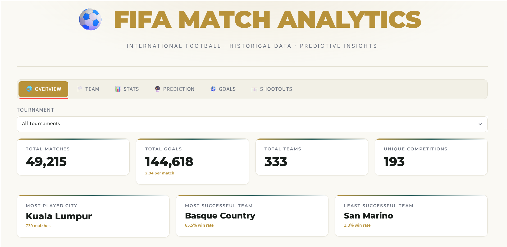
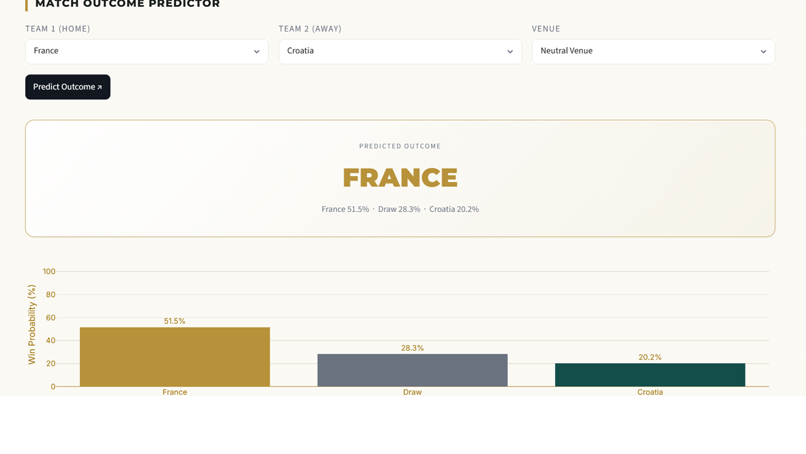

# ⚽ FIFA Match Analytics Dashboard


## 🔗 Live Demo
👉 **[Click here to open the app](https://fifadashboardtest2py-ga4chhizg5zihiffrbck3v.streamlit.app/)**

---

## 📌 Overview
An end-to-end data analytics dashboard built on international 
football match data, featuring interactive visualizations across 
6 tabs and a machine learning model to predict match outcomes.

---

## 🎯 Features
- **Overview Tab** — total matches, goals, teams, competitions KPIs
- **Team Tab** — home/away breakdown, win/draw/loss, recent form badges
- **Stats Tab** — head-to-head comparison with time range filter
- **Prediction Tab** — Win/Draw/Loss predictor using ML
- **Goals Tab** — goal types, top scorers, goals by match period
- **Shootouts Tab** — penalty shootout records and first-shooter stats

---

## 🤖 ML Model
| Detail | Value |
|--------|-------|
| Algorithm | Logistic Regression |
| Preprocessing | StandardScaler |
| Features | Win rate diff, Goals ratio diff, Neutral venue |
| Classes | Team 1 Win / Draw / Team 2 Win |
| Accuracy | ~55.2% |
| Train/Test Split | 80/20 |

> **Context:** Football match prediction is one of the hardest 
> sports forecasting problems. Published academic models on the 
> same 3-class problem (Win/Draw/Loss) report 52–58% accuracy. 
> Bookmaker baselines sit at ~52%. This model is competitive.

> **Fix applied:** Difference-based features used instead of raw 
> stats to eliminate input-order sensitivity — swapping Team 1 
> and Team 2 now correctly flips the prediction.

---

## 🛠️ Tech Stack
- **Language:** Python
- **Dashboard:** Streamlit
- **ML:** Scikit-learn
- **Data:** Pandas, NumPy
- **Charts:** Plotly

---

## 📁 Dataset
International football results dataset from Kaggle
covering matches from 1872 to present.

[🔗 Dataset Link](https://www.kaggle.com/datasets/martj42/international-football-results-from-1872-to-2017)

---

## 🚀 Run Locally
```bash
git clone https://github.com/thedivineson/FIFA-match-analysis.git
cd "FIFA PROJECT"
pip install -r requirements.txt
streamlit run fifa_dashboard_test2.py
```

---

## 📷 Screenshots


